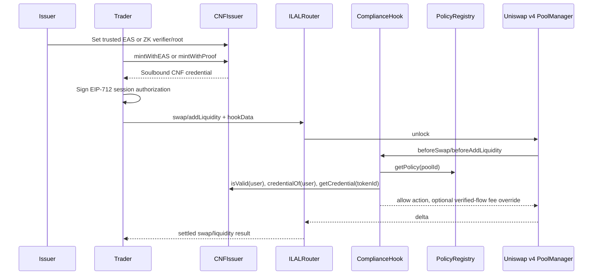

# ILAL Architecture One-Pager

Project: ILAL - Institutional Liquidity Access Layer  
Version: v0.2.5  
Purpose: turn compliance from a pre-trade bottleneck into a Uniswap v4-native trading signal.

## Problem

Institutions entering DeFi face a three-way tradeoff:

1. Compliance: pools must restrict access to eligible counterparties.
2. Cost: repeated KYC/ZK checks per swap are too expensive.
3. Privacy: institutions do not want to reveal full identity or strategy on every trade.

ILAL moves the heavy eligibility check to credential issuance, then lets the Uniswap v4 hook enforce a cheap, private, one-time session authorization for each swap or liquidity action.

## Core Components

| Component | Role |
|---|---|
| `CNFIssuer` | Mints non-transferable compliance credentials through EAS or ZK proof. Stores only credential state, not identity. |
| `ComplianceHook` | Uniswap v4 hook that gates swap/add/remove liquidity through session + CNF + pool policy checks. |
| `PolicyRegistry` | Maps each pool ID to required issuer and credential type. |
| `ILALRouter` | User-facing execution channel for swap and liquidity through Uniswap v4 PoolManager. |
| `Groth16VerifierAdapter` | Adapter from ILAL generated verifier to the `IGroth16Verifier` interface expected by `CNFIssuer`. |
| CLI / SDK | Generates proofs, prepares roots, signs sessions, checks readiness, and submits transactions. |

## Happy Path

## Security Properties

| Property | Mechanism |
|---|---|
| No direct pool bypass | Active hook functions are callable only by PoolManager. |
| No cross-chain replay | Session token includes chainId; EIP-712 domain includes chainId. |
| No cross-hook replay | Session token includes verifying hook address. |
| No cross-pool replay | Session token includes poolId. |
| No cross-action replay | Session token includes action code. |
| No router-fee bypass | Hook only accepts PoolManager senders equal to the immutable `authorizedRouter`. |
| No nonce replay | Permit2-style bitmap consumes each nonce once. |
| Revocation is immediate | Hook checks live `CNFIssuer.isValid(user)` on every action. |
| Proof bound to wallet | ZK public input wallet hash must equal `keccak256(msg.sender) >> 4`. |
| Better deal for verified flow | Dynamic-fee pools receive verified-flow LP fee override to 0.05%. |

## Current Base Sepolia Demo

| Component | Address |
|---|---|
| CNFIssuer | `0x33541301e35d33eDf554c4DFba1e04d04FCc52F4` |
| ZKVerifierAdapter | `0x9467ED8d962221e3C1865a387481B862B1b5bE95` |
| PolicyRegistry | `0x83d8111B415E97bA91eaAe717c2D9Ae6f0DD19d4` |
| ComplianceHook | `0x604f06000E7424E3AA432aB9378D4839Edeb8A80` |
| ILALRouter | `0x805A7654bDCfF1286652de29D2aE906a87e2a912` |
| Pool ID | `0xf3a6493827291a485652ae73e1ef5d673c2ad6f0e8df9ed0f54b3725fc42828e` |

Live evidence:

- ZK CNF mint: `0xb9aa16c9604a575c8b2281cbfe9ba24fedbf205283a7b05638fbc413ed78de41`
- Add liquidity: `0x8b2b87ca74debf9988e09ee06dccdd3ff73d759a4c5508f36cf53b0c4af12d33`
- Swap: `0xb67dc74b85d40ef23c16e925b33e5959b9f3d467c5c2e06fe3a43f17ce18ddd5`
- Safe LP exit: `0xc1f80cef49d0d256c616d5c567181958592f13a1a32d8af2e3eb2a6870cfe826`
- Router binding: `ComplianceHook.authorizedRouter() = 0x805A7654bDCfF1286652de29D2aE906a87e2a912`

## Integration Model

An institution or market maker integrates ILAL by:

1. Getting or issuing an eligible CNF credential.
2. Adding ILAL session signing to its trading system.
3. Routing eligible swaps/liquidity actions through `ILALRouter`.
4. Monitoring `PolicyRegistry`, issuer metadata, and pool readiness.

The trading path remains Uniswap v4-native: the hook enforces access at PoolManager execution time; ILAL is not a custodial venue or centralized matching API.
