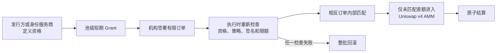

# ILAL 项目介绍

更新时间：2026 年 9 月 29 日  
适合读者：第一次接触 ILAL 的稳定币发行方、机构、流动性提供者、投资人和技术尽调人员

## 一句话介绍

**ILAL 是面向许可型数字资产流动性的策略控制原子执行与结算基础设施。**

它让资产发行方定义谁可以进入特定流动性池，让合资格机构提交有边界的签名订单，先在同一批次内匹配相反交易，再把未匹配的净差额交给 Uniswap v4 执行。资格、签名、价格限制、余额和策略在实际执行时重新检查；任一条件不成立，整批交易回滚。

ILAL 首个产品场景是稳定币发行方的受控二级流动性：

- **Asset A：Issuer Stablecoin**，由发行方控制发行，并定义对应 ILAL 池的参与资格。
- **Asset B：Settlement Asset**，由独立结算资产运营方控制，作为交易的现金腿。
- **参与者：**发行方、结算资产运营方、LP、两家机构和执行者使用分离角色。

ILAL 不替发行方做 KYC/KYB 判断，也不提供法币发行、赎回、托管或监管许可。它把发行方或其身份服务商作出的资格决定，落实到链上的交易执行环节。

## ILAL 解决什么问题

发行受控数字资产之后，发行方通常还要面对二级流动性问题：

1. 谁可以为资产提供流动性或交易？
2. 报价时合规的参与者，在成交时是否仍然合规？
3. 两家机构存在相反需求时，是否必须把全部交易量暴露给公开 AMM？
4. 资格撤销或策略关闭后，LP 的本金会不会被锁住？
5. 外部人员如何验证系统确实按这些规则执行？

ILAL 把这些问题放进同一个原子流程：资格证明产生短期池级 grant；交易者仍需单独签署订单并提供 ERC-20 allowance；执行器可以提交订单，但不能改变用户签署的金额、价格、期限、AMM 暴露上限或 nonce；最后由 Uniswap v4 PoolManager 在一笔交易内完成内部匹配、剩余量执行和结算。

## 两项核心规则

### 1. 只有未匹配差额可以进入公开 AMM

> **Only the unmatched residual may reach public AMM liquidity. Internally matched flow must never be exposed to the AMM.**

公开基准场景中，机构 A 输入 100 单位发行方资产，机构 B 反向输入 70 单位结算资产，价格按 1:1 计算：

| 指标 | 数量 | 占 gross 比例 |
| --- | ---: | ---: |
| Gross institutional flow | 170 | 100% |
| Internally matched flow | 140 | 82.3529% |
| Public AMM exposure | 30 | 17.6471% |

140 代表双边各 70 单位的已匹配输入总和。它不是单边 140 单位成交额。该结果说明本场景把 AMM 输入从 170 压缩到 30；**82.35% 是这组订单的输入压缩比例，不是收益率，也不是普遍的成本节省率。** 实际经济结果取决于订单方向、匹配率、资产价格、流动性、Gas 和运营成本。

### 2. 策略执行不能锁住 LP 本金

> **Policy enforcement must never trap LP principal. Eligibility controls new risk-taking actions, not withdrawal of existing assets.**

新增流动性需要有效资格。资格撤销、grant 过期、策略变化或 oracle 异常可以阻止新的风险操作，但已授权的仓位所有者仍应能够领取费用并退出本金。该规则保护退出权，不保证资产价值，也不消除做市和智能合约风险。

## 一笔交易如何完成

ILAL 将三类授权分开处理：

| 授权 | 回答的问题 | 是否可以替代其他授权 |
| --- | --- | --- |
| 资格 / Grant | 谁可以参与这个池 | 不可以 |
| EIP-712 订单签名 | 用户允许执行哪笔交易 | 不可以 |
| ERC-20 Allowance | 哪个路由可以移动多少代币 | 不可以 |

Quote 会执行完整模拟，然后强制回滚，因此不会消耗 nonce 或移动资产，也不会变成成交许可。正式执行会再次读取当时的资格、策略 revision、签名、期限、余额、allowance 和市场限制。这解决了“报价时有效、执行时已经失效”的时间差问题。

相反订单先在 Router 内计算匹配量；只有 residual 被送入 AMM 曲线。整个过程发生在一次 PoolManager unlock 中，协议不需要跨交易托管用户资产。

## 已经完成的公开验证

### Base Sepolia ZK_ONLY 发行方沙盒

当前最新公开 ZK 候选为 `v1.0.0-issuer-pilot-testnet.3`，运行在 Base Sepolia，chain ID 为 `84532`。证据固定在区块 `47436852`，区块哈希为 `0x6c610e8f…c2a3`。

| 验证项目 | 公开结果 |
| --- | --- |
| 角色分离 | 7 个不同地址：部署者、发行方、结算资产运营方、LP、机构 A、机构 B、执行者 |
| 资格路径 | `ZK_ONLY` |
| ZK 参与者 | LP、机构 A、机构 B，共 3 份钱包绑定的 Groth16 proof |
| ZK 公共输入 | 9 个：钱包、发行方域、schema、到期时间、credential root、最低 KYC 层级、jurisdiction root、policy hash、circuit version |
| 私有信息 | KYC 层级、国家/地区和 Merkle path 不公开 |
| 成功执行 | 170 gross → 140 internal match → 30 AMM input |
| 机构 A 输出 | 输入 100 zkUSD，收到 99.984991 sUSDC |
| 机构 B 输出 | 输入 70 sUSDC，收到 70 zkUSD |
| Residual 执行 | 30 zkUSD → 29.984991 sUSDC，差额约 5.003 bps |
| 策略变化测试 | 有效 quote 后退休 credential root；相同签名订单执行回滚 |
| LP 安全 | root 失效后仍成功领取非零费用并完整退出 |
| 协议临时库存 | Hook、Execution Router、Liquidity Router 的两种用户资产最终余额均为 0 |

成功的 100/70 执行交易为 [`0x09c0…57bf`](https://sepolia.basescan.org/tx/0x09c0efd86c9e78bc68a69eb5c6bdd16e372047ca9b038ec66aca622f075457bf)。发行方随后退休 credential root，原签名订单的执行交易 [`0x4fc3…9934`](https://sepolia.basescan.org/tx/0x4fc312400f5d339f20c963bb621b0e9e654637f6b10e821fdda359c216709934) 按预期回滚；固定区块验证确认代币余额、订单 nonce、池状态和 LP 仓位没有被失败执行改变。

LP 在资格路径失效后，通过 [`collect`](https://sepolia.basescan.org/tx/0xab690cce26628e747cad754e3591dcbfa7d4ec7489cbd040a1e31bde317b1d63) 独立领取 `14,999` 个最小单位，即 `0.014999 zkUSD` 的非零费用，随后通过 [`exit`](https://sepolia.basescan.org/tx/0x72d8b0a6edff2cdbeb68cdbc78ac2cd10d996fcc018d870159171242d509d9b1) 移除全部 `100,000,000,000,000` 流动性单位。

这些结论来自版本化 manifest、交易 receipt、事件、签名订单、quote、前后状态、nonce 和余额，而不只是演示页面上的数字。公开 evidence 的 SHA-256 为 `ff8fa3741425f29dcf25b078522d5f8732b2699f9c2ba318c42575f0ca376a3b`。

### 工程验证

当前完整 `make verify` 覆盖：

- Solidity 单元、fuzz 与状态 invariant；基础合约套件记录为 128 passed、2 skipped。
- 单独启用真实 Groth16 proof 与差分路径的 Mixed 套件，记录为 50 passed。
- 2,500 轮、100,000 次 handler 调用的资产守恒、零托管和上下文关闭 invariant。
- CLI、SDK、电路约束、ABI、合约大小、本地发行方完整流程、secret scan 和 SBOM。
- 发行方证据的篡改检测，包括错误区块、签名、quote、交易目标、nonce、流量和费用字段。

这些测试套件存在覆盖重叠，不能把数字简单相加为“独立测试总数”。测试通过说明已测配置符合断言，不等同于独立审计或形式化安全证明。

## 为什么 ZK 有价值

CNF 可以直接表示可撤销资格，适合清晰的沙盒演示。ZK 路径允许参与者证明自己满足发行方定义的条件，同时不把完整身份属性写入公开链上状态。

当前电路 v2 固定了 9 个公共输入、219 个私有输入和 256,308 条约束。源码集合已经冻结，摘要为 `cbf3a35b3823c8d614f300af8cff41edca43fbfcd26134d1975a14f8acf59803`。任何电路源码、树深、公共输入顺序或 verifier 接口变化，都要求新电路版本和新 ceremony。

`.3` 使用的是 **unsafe development ceremony**，只适用于公开测试网验证。项目已准备独立 ceremony 的贡献链、公开 beacon、artifact hash 和独立验证格式，但真正的独立仪式仍需要外部 coordinator、至少两个独立贡献组织和独立 verifier 完成。

## 当前处于什么阶段

ILAL 已经超过概念和静态原型阶段：协议、SDK、CLI、完整本地流程和 Base Sepolia 链上演练都可以运行，也已经形成机器可核查的证据包。

当前准确状态是：

| 项目 | 状态 |
| --- | --- |
| 统一协议与发行方场景 | 已实现 |
| 本地完整复现 | 已完成 |
| Base Sepolia CNF 演练 | 已完成 v1；更严格 evidence v2 等待真实 48 小时 timelock 后完成 |
| Base Sepolia ZK_ONLY 演练 | 已完成 `.3` 开发 ceremony 版本 |
| Circuit v2 freeze | 已完成 |
| 独立 ZK ceremony | 尚需外部参与者 |
| 真实发行方控制 Asset A 的同生命周期试点 | 尚需发行方 |
| 独立安全审计与生产治理 | 尚未完成 |
| 生产状态 | 未就绪 |

目前没有证据支持宣称已有生产客户、真实资产规模、收入或客户 ROI。所有公开资产都是测试资产；七个角色由不同地址承担，但不能据此称为七家独立机构参与。

## 下一阶段

项目下一步不需要增加更多电路，而是替换两类信任输入：

1. **独立 ceremony：**外部 coordinator、贡献者和 verifier 对冻结的 Circuit v2 完成独立 Groth16 phase 2 仪式。
2. **真实 Asset A 发行人：**由真实发行人控制测试资产发行、ILAL 池政策和身份服务关系，重新执行同一套 `.3` 生命周期。

完成后，ILAL 才能从“公开可复现的测试网发行方沙盒”推进到“可由发行人和第三方技术团队尽调的真实发行方试点”。独立合约、电路和基础设施审计，Safe/HSM 权限治理，真实 KYC/KYB 接入，生产资产、oracle、监控和法律审查仍是生产门槛。

## 证据入口

- [项目 README](../README.md)
- [发行方试点说明](pilot/ISSUER_PILOT.md)
- [ZK 试点说明](pilot/ZK_PILOT.md)
- [Base Sepolia `.3` deployment manifest](../deployments/base-sepolia/v1.0.0-issuer-pilot-testnet.3.json)
- [Base Sepolia `.3` public evidence](../deployments/base-sepolia/evidence/v1.0.0-issuer-pilot-testnet.3.json)
- [Evidence v2 说明](pilot/EVIDENCE_V2.md)
- [尽调准备状态](diligence/READINESS.md)
- [Circuit v2 freeze](data-room/CIRCUIT_V2_FREEZE.json)

ILAL 的核心判断可以概括为：**在执行时落实发行方政策，优先内部匹配机构流量，只让未匹配差额接触公开流动性，并确保策略变化不能锁住 LP 本金。**
